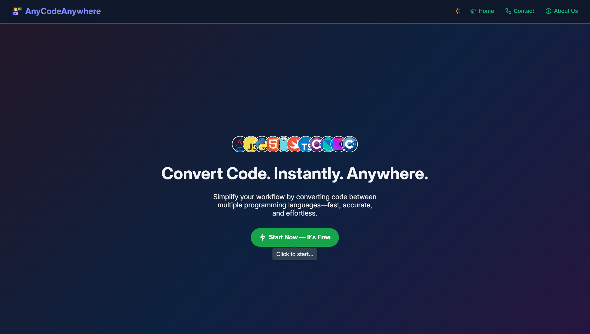

# 🧩 AnyCode Anywhere
> **Seamless Code Conversion — Anytime, Anywhere!**




**AnyCode Anywhere** is a smart, AI-driven platform that transforms code between programming languages seamlessly.  
Built with **Angular 19**, **PrimeNG** & **Flask**, it provides a clean, intuitive, and premium user experience for developers.  
Whether you're coding on desktop or mobile, AnyCode Anywhere ensures effortless code conversion — anytime, anywhere.

---

## ✨ Features

- 🚀 **Instant Code Conversion** between multiple programming languages.
- 🎨 **Modern, Responsive UI** with dark/light theme toggle.
- 🗂️ **Real-time State Management** with LocalStorage persistence.
- 📥 **Download & Copy** converted code with smart button states.
- 🌐 **Seamless Backend Integration** with Flask-powered API.
- 🌍 **CORS-enabled Flask Backend** for secure communication.
- 📬 **Contact Form** with database storage and animated UI.
- 🎨 **Glassmorphism Design** with animated backgrounds for a premium SaaS feel.

---

## 🛠️ How It Works

Converting your code with **AnyCode Anywhere** is simple:

1. **Paste** your source code into our conversion tool.
2. **Choose** your desired output language.
3. **Hit “Convert”** — and get your ready-to-use code instantly!

> **Supported Languages:**  
Python, JavaScript, Java, C++, C#, Go, PHP, Swift, Dart, Kotlin, Ruby, R, and many more.

---

## 📌 Tech Stack

- **Frontend:** Angular 19, Node.js 22
- **Libraries:** PrimeNG, PrimeFlex, PrimeIcons
- **Backend:** Flask (Python), Google Generative AI (GenAI)
- **Database:** Microsoft SQL Server (MSSQL)
- **Deployment:** Designed to be easily deployable (Vercel, Render, etc.)

---

## 📈 Project Highlights

- Full separation of concerns using Angular services and modular components.
- Responsive and mobile-optimized navigation with animated dropdown menus.
- Smooth UX with LocalStorage-powered dark mode and dynamic state management.
- Animated moving backgrounds and glass-effect forms for an ultra-premium design.
- Fast and efficient backend logic to handle code transformations securely.

---

## 🛠️ Local Setup

Follow these steps to run AnyCode Anywhere locally:

### 1. Clone the Repository

```bash
git clone https://github.com/Sayan520/AnyCode-Anywhere.git
cd AnyCode-Anywhere
```

### 2. Frontend Setup (Angular)

```bash
cd frontend
npm install
ng serve
```

> This will start the Angular frontend on `http://localhost:4200/`

### 3. Backend Setup (Flask)

```bash
cd backend
pip install -r requirements.txt
python app.py
```

> This will start the Flask backend on `http://localhost:5000/`

---

## 📬 Contact

Have questions, feedback, or want to contribute?  
Feel free to reach out through the **Contact Us** form inside the app!

Or send an email to:  
📧 **ghoshsayan5205@gmail.com**

---

## 📄 License

This project is licensed under the **MIT License**.

---

> **Unlock the full potential of your code today with AnyCode Anywhere — the smarter way to transform code.**
